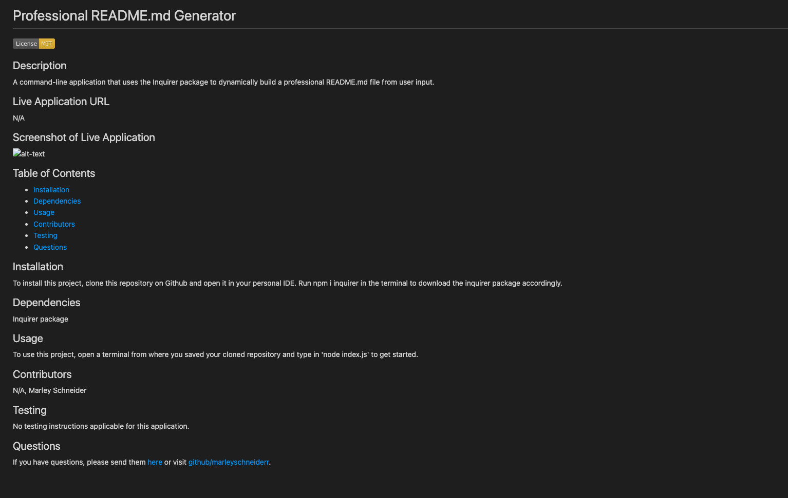

# Professional README.md Generator 
No License

## Description
A command-line tool that uses the Inquirer Package to dynamically build a professional README.md file from user input.

## Walkthrough Tutorial of Application
https://drive.google.com/file/d/1sOq39xGsokfRhCj_DMX-14dDmNhbA-GI/view

## Screenshot of Live Application

## Table of Contents
* [Installation](#installation)
* [Dependencies](#dependencies)
* [Usage](#usage)
* [Contributors](#contributors)
* [Testing](#testing)
* [Questions](#questions)

## Installation
To install this project, clone this repository on Github and open it in your personal IDE. Run npm i inquirer in the terminal.

## Dependencies 
Inquirier Package, Node.js

## Usage
To use this project, open a terminal from where you saved your cloned repository and type in 'node index.js' to get started. 

## Contributors 
N/A, Marley Schneider

## License

This project is licensed under the [ISC](https://opensource.org/license/isc-license-txt/) license. 

## Testing
No testing instructions applicable for this application.

## Questions
If you have questions, please send them [here](mailto:marleysue@gmail.com?subject=[GitHub]%20Dev%20Connect) or visit [github/marleyschneiderr](https://github.com/marleyschneiderr).