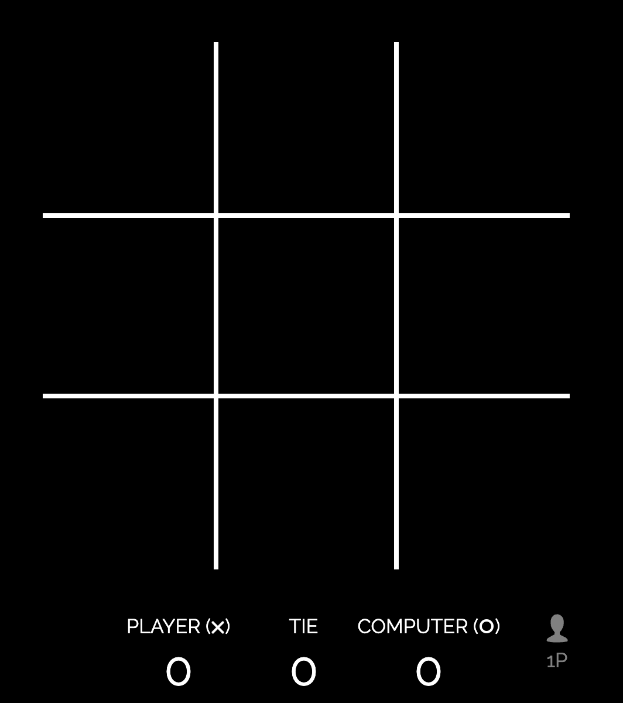

# Tic Tac Toe 

## Description
A basic Tic Tac Toe game created with HTML, CSS, and Javascript.

## Live Application URL
https://playtictactoe.org/

## Screenshot of Live Application

## Table of Contents
* [Installation](#installation)
* [Dependencies](#dependencies)
* [Usage](#usage)
* [Contributors](#contributors)
* [License](#license)
* [Testing](#testing)
* [Questions](#questions)

## Installation
To install this project, clone the repository from marleyschneiderr's Github page and run the code!

## Dependencies 
No dependencies!

## Usage
To use this project, grab a partner and click one at a time on different squares to try to get three in a row! 

## Contributors 
Spongebob Squarepants and Patrick Star

## Testing
No applicable testing instructions needed for this application.

## License

This project is licensed under the [Creative Commons](https://creativecommons.org/licenses/by/4.0/) license. 

## Questions
If you have questions, please send them [here](mailto:marleysue@gmail.com?subject=[GitHub]%20Dev%20Connect) or visit [github/marleyschneiderr](https://github.com/marleyschneiderr).